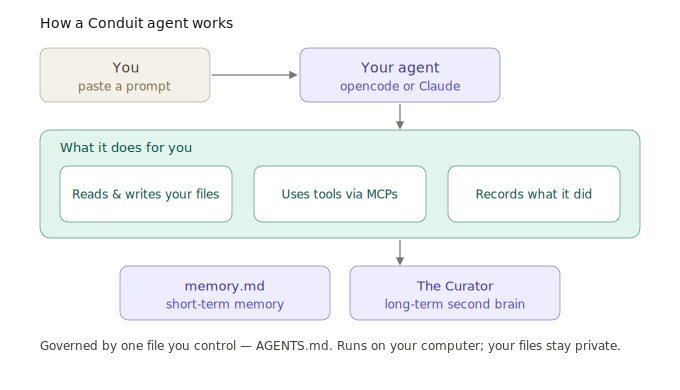

# The concepts

You don't need to read this to use Conduit — but it helps to understand *what* you're building. Conduit agents share one simple model, no matter the use case.

---

## An agent is four things

1. **A job description** — who it is and what it's for.
2. **A mandate** — what it may do, what it must never do, and what needs your approval.
3. **Memory & context** — where it left off now (working memory), and the compounding context it reasons with (the context layer).
4. **A record** — an honest trail of what it actually did.

All four live in plain files in a folder on your computer. The most important file is **`AGENTS.md`** (or `CLAUDE.md`) — it holds the job description and the mandate. Everything else hangs off it.

---

## The layers

A Conduit agent is organized into layers. Not all are required — you turn on what you need.

| Layer | What it does | Status |
|---|---|---|
| 🎯 **Execution** | The actual work — your project, tasks, deliverables, evidence | Required |
| 🧠 **Memory & Context** | Working memory (`memory.md`) + context layer ([The Curator](05-the-curator.md)) | Required |
| 📊 **Data** | Structured tracking — spreadsheets, logs | Recommended |
| 📡 **Intelligence** | Outside data the agent watches — web sources, signals | Optional |
| 📧 **Communication** | An agent-owned mailbox for sending/receiving email | Optional |
| 🧾 **Governance / Ledger** | Boundaries enforced + a tamper-evident record | Optional* |

\* *Optional in the universal framework. The Cotrugli use case makes the ledger **required** — that's a choice a use case can make.*

> The six-layer architecture comes from Conduit's first use case. Your use case can use as few as two layers (Execution + Memory & Context) or all of them.

---

## The mandate: governance you can read

The single most important idea in Conduit: **the config file *is* the mandate.** In `AGENTS.md` you declare three lists in plain language:

- **Allowed actions** — what the agent may do for you.
- **Forbidden actions** — hard limits it must never cross.
- **Actions requiring approval** — things it may do *only after you confirm*, like sending an email.

The agent reads these every session and stays inside them. If you ask it to do something forbidden, it declines and records why. This is what makes a Conduit agent *trustworthy* — its boundaries are written down, in language you understand, and you can change them any time by editing one file.

→ Deep dive: [The agent config](03-the-agent-config.md) · [Governance & the ledger](07-governance-ledger.md)

---

## Memory and context: two halves

- **Working memory — `memory.md`.** A small file the agent reads at the start of every session and updates at the end. It's how the agent "remembers where it left off" between conversations.
- **Context layer — The Curator.** A local app that turns your documents and notes into a *knowledge graph* the agent can query. This is the agent's **compounding context** — a second brain (or a shared brain for a team): the more you add, the more context it reasons with. Building a second brain *is* building context, for you and your agents.

→ Deep dive: [Memory & context](04-memory.md) · [The Curator](05-the-curator.md)

---

## Capabilities come from MCPs

Out of the box, an agent can read and write files in its folder. To do more — write Excel, send email, query The Curator — it connects to **MCP servers** (Model Context Protocol). Think of an MCP as a plug-in that gives the agent a new ability. You install them *by prompt*, and the agent records what it added.

→ Deep dive: [MCPs](06-mcps.md)

---

## Why prompt-driven matters

Traditional setup means editing config files and running terminal commands — a wall for non-technical people. Conduit flips it: **you describe what you want; the agent does the technical work.** It installs its own runtimes, writes its own config to the right file, tests that things work, and — crucially — *writes back into `AGENTS.md` what it set up*, so the next session knows. The agent is self-documenting.

---

## Putting it together

Ready to build? → [Start here](00-start-here.md)
