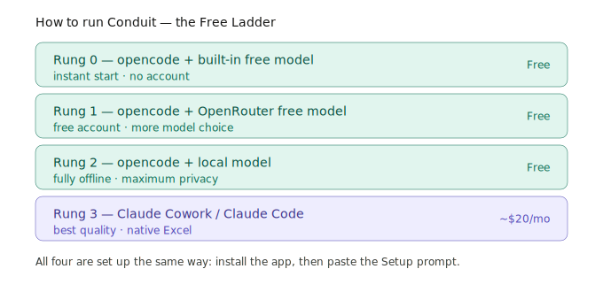

# Choose your runtime — the Free Ladder

Your agent runs inside a **harness**: an app that reads your files, runs setup, and talks to a language **model**. You need exactly one harness and one model to start. This page is the "Free Ladder" — four ways to run Conduit, from *zero cost / zero accounts* up to *best quality*. Pick the rung that fits you. You can always move up or down later.



> **All four rungs are set up the same way:** install the app, then paste the [Setup prompt](../templates/prompts/setup.md). The only difference is which model answers.

---

## 🪜 Rung 0 — opencode + a built-in free model

**Best for:** getting started instantly, demos, students, anyone without a subscription.

- **Cost:** Free. **Accounts:** None.
- [opencode](https://opencode.ai) is an open-source agent harness. It ships with free models built in — pick one on first launch and you're running.

**Setup:**
1. Download opencode from [opencode.ai](https://opencode.ai) and install (~2 min).
2. Open it and select a **free model** from the list.
3. Open your agent folder (`File ▸ Open Folder`) and paste the [Setup prompt](../templates/prompts/setup.md).

---

## 🪜 Rung 1 — opencode + an OpenRouter free model

**Best for:** more model choice while staying free.

- **Cost:** Free models available. **Accounts:** A free [OpenRouter](https://openrouter.ai) account + API key.
- [OpenRouter](https://openrouter.ai) is a single gateway to many models, and several are free at any time.

**Setup:**
1. Install opencode (Rung 0).
2. Make a free account at [openrouter.ai](https://openrouter.ai) and create an API key.
3. Paste this prompt into opencode:

   ```
   I want to use OpenRouter as my model provider in opencode. Add my OpenRouter
   API key to opencode's configuration (store it securely — never write the key
   into AGENTS.md or any project file). Then list the free models currently
   available on OpenRouter and set one as my default. Explain each step.
   I will paste the key when you ask for it.
   ```

> 🔒 Your API key is stored by opencode, never in your project files.

---

## 🪜 Rung 2 — opencode + a local model (fully offline)

**Best for:** maximum privacy — nothing ever leaves your machine.

- **Cost:** Free. **Accounts:** None. **Internet:** Not needed once the model is downloaded.
- Tools like [Ollama](https://ollama.com) or [LM Studio](https://lmstudio.ai) run open models directly on your computer.

**Setup:**
1. Install opencode (Rung 0).
2. Paste this prompt into opencode:

   ```
   I want to run a local language model on this computer and use it from opencode,
   so nothing leaves my machine. Check whether Ollama is installed; if not, install
   it for me. Then pull a small, capable instruct model suitable for my hardware,
   start it, and configure opencode to use it as the default model. Explain each
   step in plain language and tell me roughly how much disk and memory it needs.
   ```

> 💡 Local models need a reasonably capable computer (more RAM = larger, smarter models). The agent will recommend a model that fits.

---

## 🪜 Rung 3 — Claude Cowork or Claude Code

**Best for:** the best quality and smoothest experience.

- **Cost:** ~$20/month (Claude Pro). **Accounts:** A Claude account.
- **Claude Cowork** is a tab inside Claude Desktop that runs locally with file and shell access — so it can do the whole Conduit setup, just like opencode. **Claude Code** (CLI) also works.
- Bonus: Claude reads and writes **Excel natively** — no spreadsheet plug-in needed.

**Setup:**
1. Download Claude Desktop from [claude.ai/download](https://claude.ai/download) and sign in.
2. Open the **Cowork** tab and point it at your agent folder.
3. Rename your `AGENTS.md` to **`CLAUDE.md`**.
4. Paste the [Setup prompt](../templates/prompts/setup.md).

> ⚠️ **Use Cowork, not the normal chat window.** Plain Claude Chat is not an agent — it can't touch your files or install anything. All setup happens in **Cowork** (or Claude Code).

---

## Comparison

| | Rung 0 | Rung 1 | Rung 2 | Rung 3 |
|---|---|---|---|---|
| Harness | opencode | opencode | opencode | Claude Cowork/Code |
| Model | Built-in free | OpenRouter free | Local (offline) | Claude |
| Cost | Free | Free | Free | ~$20/mo |
| Account needed | None | OpenRouter | None | Claude |
| Privacy | High | High | **Highest** | High |
| Quality | Good | Good+ | Varies by machine | **Best** |
| Excel | Add MCP | Add MCP | Add MCP | **Native** |

---

## One thing to remember: don't cross the streams

opencode and Claude Desktop keep their MCP settings in **different files** — and in **different JSON formats**:

- **opencode** → the project-level `opencode.jsonc` *inside your project folder* (opencode's `mcp` format)
- **Claude Desktop** → `claude_desktop_config.json` *(system location)*, in Claude's `mcpServers` format — and you must **restart Claude Desktop** after any change.

You never edit these by hand — the agent does, and every install prompt gives it the right file *and* the right format. Just don't ask an opencode agent to edit the Claude file (or reuse Claude's JSON on opencode), or vice-versa. → [the two formats, side by side](06-mcps.md)

---

Next: [The agent config →](03-the-agent-config.md)
