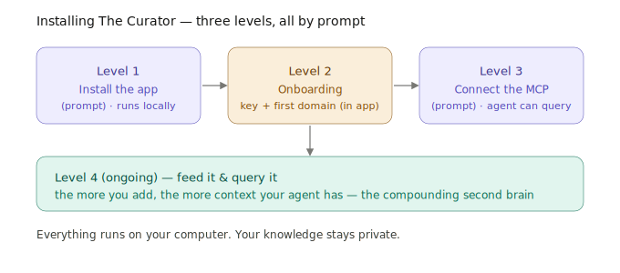

# The Curator — your agent's second brain

> **In one line:** The Curator is the difference between an agent that starts *cold* every session and one that *remembers everything you've taught it.*

The Curator is an open-source app that runs on **your computer**. You feed it documents, notes, and research; it organizes them into a **knowledge graph** — a connected web of ideas — that your agent can query any time. This is your agent's **long-term, compounding memory.**

- **Repository:** https://github.com/talirezun/the-curator
- **User guide:** https://github.com/talirezun/the-curator/blob/main/docs/user-guide.md

---

## Why it matters

A language model is brilliant but forgetful. Without long-term memory, your agent begins every session knowing nothing about you, your company, or your past work — so it guesses, and you re-explain.

The Curator fixes this:

- **It compounds.** Every document and note you add makes the agent more capable next time. Knowledge accumulates instead of evaporating.
- **It grounds the agent in *your* reality.** When the agent does a task, it can pull from what you actually know — your playbooks, your research, your decisions — instead of generic guesses.
- **It's organized, not a dump.** Knowledge becomes a graph of connected ideas split into **domains**. You might keep one domain for your personal knowledge and another as a "company brain." The agent queries the right domain for the task.
- **It stays private.** The Curator runs locally. Your knowledge lives on your machine.

> Think of `memory.md` as the agent's short-term memory of *this project*, and The Curator as its long-term memory of *everything you know*. → [Memory](04-memory.md)

---

## How the MCP works

The agent talks to The Curator through an **MCP** (Model Context Protocol) called `my-curator`. An MCP is a connector that gives the agent a new ability — here, the ability to **search and read your knowledge graph on demand.**

Once connected, your agent can, mid-task:

> *Search my Curator knowledge base for [topic]. Return the relevant notes, summaries, or context.*

…and weave the results into whatever it's doing. The knowledge graph is queried *on demand*, across sessions — so the agent always has access to the full, growing brain, not just this conversation.

---

## Installing it — three levels, all by prompt

Installing The Curator has **three distinct levels.** It helps to see them as separate steps, because they do different things. All three are driven by prompts — you don't type terminal commands.



### Level 1 — Install the app

This puts The Curator on your computer and starts it running locally.

➡️ Paste the **[Install Curator prompt](../templates/prompts/install-curator.md)** into your agent.

The agent checks for Node.js (installs it if missing), downloads The Curator, builds it, and starts the local server. On a Mac it can build a proper "The Curator.app." It then opens the app in your browser (at `http://localhost:3333`) so you can do the next level.

### Level 2 — Onboarding: API key + your first domain

When The Curator opens for the first time, an **onboarding wizard** runs *in the app*. It asks you for an API key (for the model that organizes your knowledge) and helps you create your **first domain**. This is a one-time, in-app step — the agent does not need your key.

> 💡 Make one domain for your **personal** knowledge, and (if relevant) a separate one for your **company**. Keeping them separate keeps the graph clean.

### Level 3 — Connect the MCP + usage skill so your agent can use it well

Now you connect The Curator to your *agent*. This is **Step 2** of the [Install Curator prompt](../templates/prompts/install-curator.md), and it's **split by harness** because the config format differs (see [the two formats](06-mcps.md)). It does two things:

1. **Registers the `my-curator` MCP** in the correct config file *and format* —
   - **opencode** → the project-level `opencode.jsonc` in your folder (opencode's `mcp` format)
   - **Claude Cowork / Code** → `claude_desktop_config.json` (Claude's `mcpServers` format), then **restart Claude Desktop**
2. **Installs the Curator usage skill** — a playbook that teaches the agent how to read, write, and maintain the wiki without broken links or duplicates. The MCP gives the agent the *tools*; the skill gives it the *rules*. (opencode loads it via an `instructions` entry; Claude Code puts it in `~/.claude/skills/`.)

It then records in `AGENTS.md` that long-term memory is now available. **The Curator app must be running** for the MCP to work.

```
  Level 1            Level 2                  Level 3
┌──────────┐     ┌──────────────┐       ┌────────────────────┐
│ Install  │ ──▶ │  Onboarding  │  ──▶  │  Connect my-curator │
│ the app  │     │  key + first │       │  MCP to your agent  │
│ (prompt) │     │  domain (app)│       │  (prompt)           │
└──────────┘     └──────────────┘       └────────────────────┘
   runs locally     one-time wizard        agent can now query
```

---

## Level 4 (ongoing) — Feed it and query it

The Curator is only as useful as what's in it. Ingest a few real documents early — notes, reports, research, playbooks — and keep adding over time. The [user guide](https://github.com/talirezun/the-curator/blob/main/docs/user-guide.md) walks through ingesting sources and querying domains.

Then your agent can use it. For example:

> *Before you draft the proposal, search my Curator company domain for our past pricing decisions and positioning notes, and use them.*

The more you add, the smarter your agent gets. That's the compounding second brain.

---

## Optional — GitHub sync

The Curator can sync to GitHub so your knowledge graph is backed up and shareable. See `docs/sync.md` in the [Curator repository](https://github.com/talirezun/the-curator).

---

Next: [MCPs — more capabilities →](06-mcps.md)
