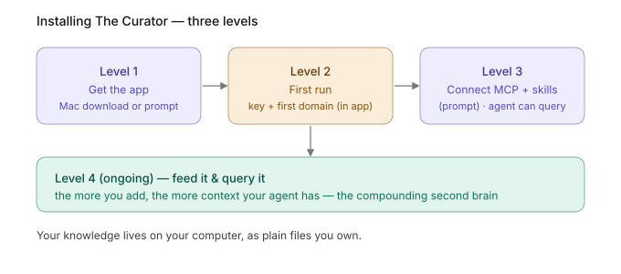

# The Curator — your agent's context layer

> **In one line:** The Curator is the difference between an agent that starts *cold* every session and one that works with the full **context** of everything you've taught it.

The Curator is an open-source app that runs on **your computer**. You feed it documents, notes, and research; it organizes them into a **knowledge graph** — a connected web of ideas — that your agent can query any time. This is your agent's **context layer: compounding context** it draws on to ground its work in what you actually know.

> **The idea in a sentence.** A large language model has reasoning but no context about *you*. Building a **second brain** — or a **shared brain** for a team — is how you build that context. You're not just storing notes; you're assembling the context your agents (and you) reason with, and it **compounds** with every source you add.

- **Repository:** https://github.com/talirezun/the-curator
- **User guide:** https://github.com/talirezun/the-curator/blob/main/docs/user-guide.md

---

## Why it matters

A language model is brilliant but has no context of its own. Without a context layer, your agent begins every session knowing nothing about you, your company, or your past work — so it guesses, and you re-explain.

The Curator fixes this:

- **It compounds.** Every document and note you add makes the agent more capable next time. Context accumulates instead of evaporating — a shift from a file cabinet to a neural network.
- **It grounds the agent in *your* reality.** When the agent does a task, it can pull the context you actually have — your playbooks, your research, your decisions — instead of generic guesses. It isn't retrieval-on-every-query (RAG); the knowledge is compiled once into a graph and kept current.
- **It's organized, not a dump.** Context becomes a graph of connected ideas split into **domains**. You might keep one domain for your personal knowledge and another as a "company brain." The agent queries the right domain for the task.
- **It stays private.** The Curator runs locally. Your context lives on your machine.

> Think of `memory.md` as the agent's **working memory** of *this project*, and The Curator as its **context layer** — the compounding context of *everything you know*. → [Memory & context](04-memory.md)

---

## How the MCP works

The agent talks to The Curator through an **MCP** (Model Context Protocol) called `my-curator`. An MCP is a connector that gives the agent a new ability — here, the ability to **search and read your knowledge graph on demand.**

Once connected, your agent can, mid-task:

> *Search my Curator knowledge base for [topic]. Return the relevant notes, summaries, or context.*

…and weave the results into whatever it's doing. The graph is queried *on demand*, across sessions — so the agent always has the full, growing context, not just this conversation. This is graph-native access to your own intellectual history, not a model pretending to have read your files.

---

## Installing it — three levels

Installing The Curator has **three distinct levels.** It helps to see them as separate steps, because they do different things. Full prompts: **[Install Curator prompt](../templates/prompts/install-curator.md)**.



### Level 1 — Get the app

There are two shapes of the same program — pick one:

- **The Mac app** (macOS only) — a `.dmg` from the [Releases page](https://github.com/talirezun/the-curator/releases), for Apple Silicon or Intel. No Node.js needed, and it updates itself. It is not yet notarized by Apple, so the first launch needs one approval from you: **System Settings → Privacy & Security → Open Anyway**. This is the one install you do by hand, because macOS asks *you*. → [Mac app guide](https://github.com/talirezun/the-curator/blob/main/docs/mac-app.md)
- **The browser app** (Windows, Linux, or Mac) — installed **by prompt**: the agent checks for Node.js (installs it if missing), downloads The Curator, and starts it at `http://localhost:3333`.

### Level 2 — First run: your key and your first domain

When The Curator opens for the first time, a **Getting started** panel asks what you want to set up first. For a second brain, choose **Build a second brain**: add an **AI key** (a free Google Gemini key is the easiest start), create your **first domain**, and ingest your first source. This is a one-time, in-app step — the agent never needs your key.

> 💡 Make one domain for your **personal** context, and (if relevant) a separate one for your **company**. Keeping them separate keeps the graph clean.

### Level 3 — Connect the MCP + skills so your agent can use it well

Now you connect The Curator to your *agent*. This is **Step 3** of the [Install Curator prompt](../templates/prompts/install-curator.md), and it's **split by harness** because the config format differs (see [the two formats](06-mcps.md)). It does two things:

1. **Registers the `my-curator` MCP** in the correct config file *and format* —
   - **opencode** → the project-level `opencode.jsonc` in your folder (opencode's `mcp` format)
   - **Claude Cowork / Code** → `claude_desktop_config.json` (Claude's `mcpServers` format), then **restart Claude Desktop**. (The Curator's own **Settings → MCP bridge → Set up Claude Desktop** wizard can do this for you.)
2. **Installs The Curator's two official skills** — playbooks that teach the agent the rules: **`my-curator`** (read, write and maintain the wiki without broken links or duplicates) and **`curator-continuity`** (carry working state between sessions, tools and machines). The MCP gives the agent the *tools* (24 of them today); the skills give it the *rules*. opencode loads them from `.agents/skills/` in your folder; Claude Code from `~/.claude/skills/`.

It then records in `AGENTS.md` that the context layer is now available. **The MCP bridge reads your knowledge folder directly, so it works even when the Curator app is closed** — you only need the app open to ingest, chat, or change settings.

```
  Level 1              Level 2                  Level 3
┌────────────┐     ┌──────────────┐       ┌────────────────────┐
│ Get the app│ ──▶ │  First run   │  ──▶  │ Connect my-curator │
│ Mac: .dmg  │     │  key + first │       │ MCP + skills       │
│ or prompt  │     │  domain (app)│       │  (prompt)          │
└────────────┘     └──────────────┘       └────────────────────┘
   runs locally      one-time panel          agent can now query
```

---

## Level 4 (ongoing) — Feed it and query it

The Curator is only as useful as the context in it. Ingest a few real documents early — notes, reports, research, playbooks — and keep adding over time. The [user guide](https://github.com/talirezun/the-curator/blob/main/docs/user-guide.md) walks through ingesting sources and querying domains.

Then your agent can use it. For example:

> *Before you draft the proposal, search my Curator company domain for our past pricing decisions and positioning notes, and use them.*

The more you add, the more context your agent has to reason with. That's the compounding context layer.

> **What stays private, exactly.** Your knowledge lives as plain markdown files on your own machine — no account, no database, no service run by the project. When you **ingest** a document, its text is sent to the AI provider whose key you added, so it can be organised into the graph. Reading, searching, and the MCP bridge itself never call a model.

---

## Optional — GitHub sync and the Shared Brain

The Curator can **sync** your knowledge to your own private GitHub repository, so it is backed up and available on your other computers. → [Sync guide](https://github.com/talirezun/the-curator/blob/main/docs/sync.md)

A team or class can go further and build a **Shared Brain**: a collective context layer everyone's agents can read. Each member keeps contributing from their own domain; the admin synthesises the contributions, and everyone pulls a read-only `shared-…` domain back. It is an opt-in beta, set up in the app (**Domains → a domain → Shared Brain**) with an invite from the admin. → [Shared Brain user guide](https://github.com/talirezun/the-curator/blob/main/docs/shared-brain-user-guide.md)

---

## Advanced — managing context across sessions and tools

Beyond the wiki, The Curator can hold **working state** for a piece of work: a **project** with a standing brief, the latest **handoff** from the last session, and the project's canonical documents. Any agent — opencode, Claude, another tool, on another computer — calls `get_project_context` at the start and `save_working_state` as it goes, so work picks up where it left off instead of starting cold. That is **context management**: the step from "my agent remembers my knowledge" to "any of my agents can continue my work". Set it up in the app under **Domains → Projects**, and use **Copy agent instructions** to get the few lines your agent's config needs. → [Working state guide](https://github.com/talirezun/the-curator/blob/main/docs/working-state.md)

---

## Resources

| | |
|---|---|
| [The Curator — repository](https://github.com/talirezun/the-curator) | Source, releases, licence (MIT) |
| [User guide](https://github.com/talirezun/the-curator/blob/main/docs/user-guide.md) | Everything the app does, step by step |
| [Mac app guide](https://github.com/talirezun/the-curator/blob/main/docs/mac-app.md) | Installing, approving and updating the Mac app |
| [MCP guide](https://github.com/talirezun/the-curator/blob/main/docs/mcp-user-guide.md) | The 24 MCP tools, the skills, troubleshooting |
| [Working state](https://github.com/talirezun/the-curator/blob/main/docs/working-state.md) | Projects, handoffs and foundations — context management |
| [Shared Brain user guide](https://github.com/talirezun/the-curator/blob/main/docs/shared-brain-user-guide.md) | Joining or running a team / class Shared Brain |
| [Guide written for agents](https://github.com/talirezun/the-curator/blob/main/llm-docs/curator-user-guide.md) | A version of the user guide your agent can read to help you |

---

Next: [MCPs — more capabilities →](06-mcps.md)
