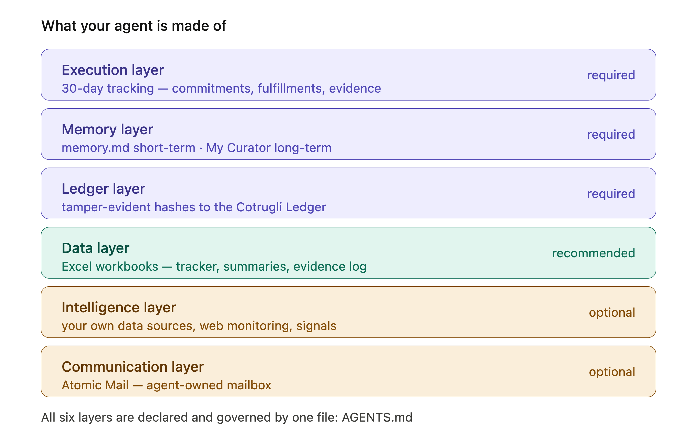
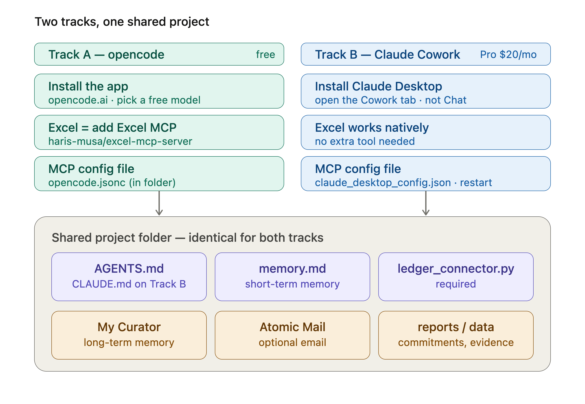
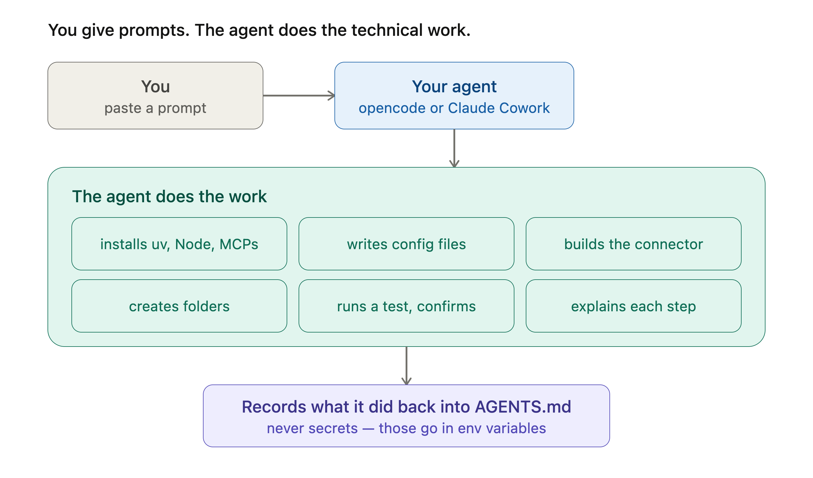
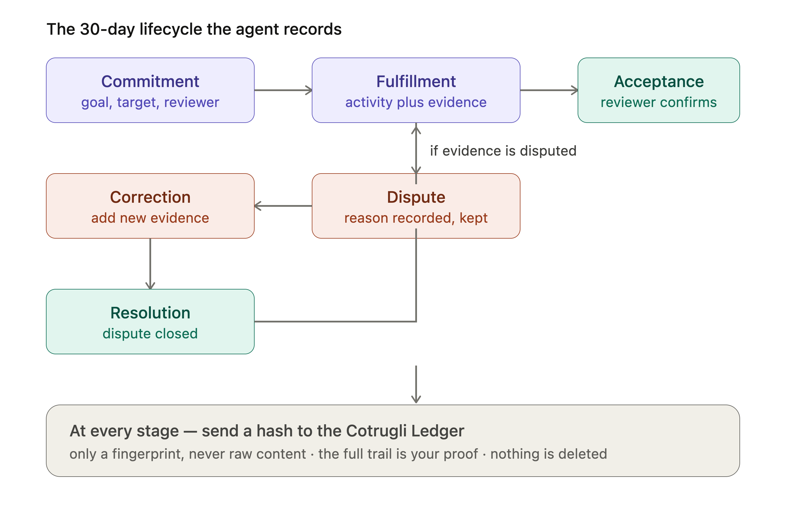
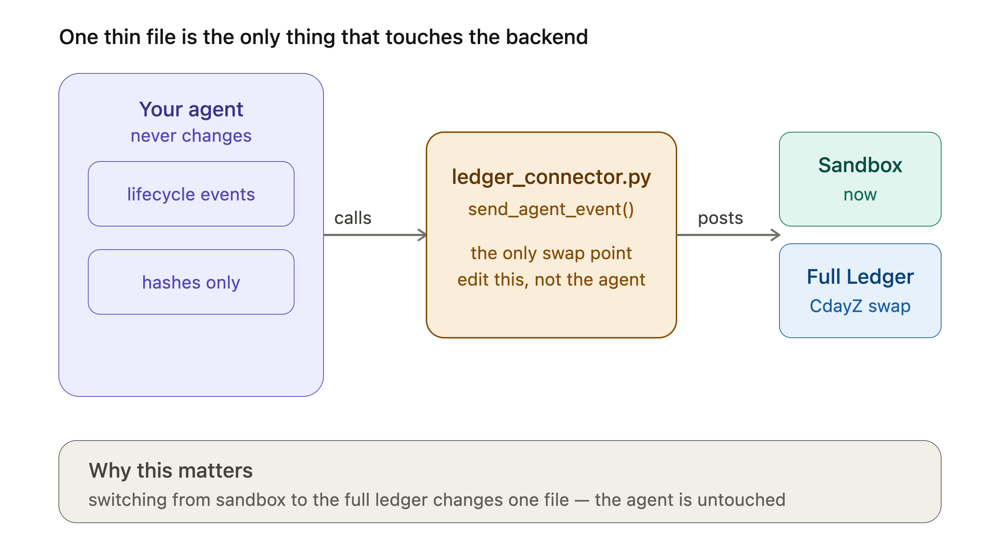

# Use case: Cotrugli Business School — Vanguard Agent Lab

*COTRUGLI Business School · Vanguard MBA · Chasing Jarvis — taught by Dr. Tali Rezun*

This is **Use Case #1** for the [Conduit framework](../../README.md): the configuration MBA students use to build a personal AI **execution agent** that drives one real 30-day improvement project — and records every step in a tamper-evident trail.

> New to Conduit? Read [docs/00-start-here.md](../../docs/00-start-here.md) and [the concepts](../../docs/01-concepts.md) first. This page assumes you understand the basics and focuses on what's *specific* to the Vanguard lab.

---

## What's in this folder

| File | What it is |
|---|---|
| **[AGENTS.md](AGENTS.md)** | The Vanguard Execution Agent config — copy this into your project folder (rename to `CLAUDE.md` on Claude). |
| **[Vanguard_Agent_Lab_Guide.md](Vanguard_Agent_Lab_Guide.md)** | The complete, step-by-step student guide (v3.0). |
| **[scenarios/](scenarios/)** | Four ready-to-use fictional business scenarios if you don't have your own yet. |
| **[images/](images/)** | The lab's diagrams. |

---

## What makes this use case distinct

The universal framework treats the ledger as optional. **This use case makes it required**, and adds a formal 30-day project lifecycle. That's a use case exercising the framework's governance layer fully.

- **A required Cotrugli Ledger connection.** Every lifecycle event is hashed and submitted via a thin `ledger_connector.py`. Only hashes leave your computer — never content. → [Governance & the ledger](../../docs/07-governance-ledger.md)
- **A six-layer agent** (Execution, Memory, Ledger, Data, Intelligence, Communication).
- **A structured 30-day lifecycle:** Commitment → Fulfillment → Acceptance → Dispute → Correction → Resolution, with strict record templates and an evidence rule (no fulfillment without named evidence).
- **A reviewer** who confirms results — mapped to a co-signer in the governance model.

---

## The diagrams

| Diagram | Shows |
|---|---|
|  | What the agent is made of |
|  | opencode vs. Claude Cowork |
|  | You prompt; the agent does the work |
|  | Commitment → … → Resolution |
|  | One thin file talks to the backend |

---

## How students run it

The full walkthrough is in the [lab guide](Vanguard_Agent_Lab_Guide.md). In short:

1. **Pick a track** — opencode (free) or Claude Cowork ($20/mo). → [Free Ladder](../../docs/02-choose-your-runtime.md)
2. **Make a folder**, drop in [AGENTS.md](AGENTS.md) (or `CLAUDE.md`).
3. **Setup prompt** → builds folders, memory, tools. ([prompt](../../templates/prompts/setup.md))
4. **Fill the config** — Personal or Company. ([prompt](../../templates/prompts/fill-config.md))
5. **Install The Curator** (long-term memory). ([prompt](../../templates/prompts/install-curator.md))
6. **Connect the Cotrugli Ledger** (required) — build `ledger_connector.py` with the Ledger Connection prompt in the [guide](Vanguard_Agent_Lab_Guide.md). Your instructor provides the API key and tenant ID.
7. **Run your project:** create your Commitment, record Fulfillments with evidence, get Acceptances, handle Disputes, produce a Run Report.

> Your instructor provides the ledger **API key** and **tenant/participant ID**. The agent stores them as environment variables — never in any file.

---

## After the course

The agent stays with you. It's a tool for your business, not a demo — keep using it, swap the goal, add MCPs, grow your Curator domains. And if you build a great configuration, consider contributing it as a new [use case](../README.md).
